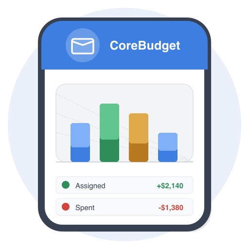

<p align="center">
  
</p>

<h1 align="center">CoreBudget</h1>

<p align="center">
  Self-hosted, multi-user personal finance app for zero-based budgeting and net worth tracking.
</p>

<p align="center">
  <a href="https://github.com/chiefpansancolt/coreBudget/actions/workflows/ci.yml">
    
  </a>
  <a href="https://github.com/chiefpansancolt/coreBudget/pkgs/container/corebudget">
    
  </a>
  <a href="LICENSE">
    
  </a>
</p>

---

## What is CoreBudget?

CoreBudget is a zero-based, envelope-style budgeting app with net worth tracking, built to run
on your own hardware instead of a subscription service. Every household member gets their own
login with two-factor authentication, and an admin controls exactly what each person can see and
edit, budget by budget, feature by feature.

No bank sync, no third-party data sharing, no market-data pulls. Every transaction, balance, and
asset value is entered by hand and stored in a Postgres database you control.

## Features

**Budgeting**

- Zero-based, rolling-envelope monthly budgeting with carryover
- Recurring/repeating transactions that post automatically and land in Needs Review
- CSV import for transactions, with column mapping and duplicate detection
- Bulk actions: assign underfunded, reset to zero, auto-categorize
- Subscriptions & memberships tracking, separate from the general ledger
- Category savings goals and target-date funding math

**Net worth**

- Manually tracked assets and liabilities, each with full historical value/balance changes
- Amortization schedules and payoff projections for loans and mortgages
- Escrow tracking for mortgage accounts
- Net worth over time, broken out by account and category

**Income & taxes**

- Per-job paycheck calculator with withholding and employer-contribution modeling
- Tax filing, withholding tracker, and retirement goal/account tracking per user

**Reports**

- Income vs. expenses, cash flow, budget vs. actual, spending by payee
- Net worth over time, debt payoff timeline, category goal progress

**Multi-user & households**

- Invite-based account creation, no open self-signup
- TOTP two-factor authentication, required for every account
- Households and budgets each own their own access grants: household membership does not imply
  budget visibility, and budget access does not imply feature-level permission
- Fine-grained per-feature permissions (read-only / edit / no access) per user, per budget
- Read-only API tokens, scoped to a single budget, for home-lab dashboards and integrations

**Admin**

- User, household, and access management from one dashboard
- Platform-wide payee list with merge and renaming rules
- Feature kill switches, instance-wide
- System health (database latency, background job history, error log)
- Automated, encrypted, schedulable database backups

**Self-hosted & installable**

- Single Docker image with an embedded PostgreSQL server, one data volume, one command to run
- Installable PWA with a service worker and web push notifications
- Light and dark mode, dark by default

## Getting started

The recommended way to run CoreBudget is the Docker image, which bundles the app and its
database in one container. See [`docker/README.md`](docker/README.md) for the full setup guide,
including upgrades and using an external Postgres instance instead of the embedded one.

Quick start:

```bash
docker run -d \
  --name corebudget \
  -p 3000:3000 \
  -e APP_ENCRYPTION_KEY="$(openssl rand -base64 32)" \
  -e APP_URL="https://budget.example.com" \
  -e SESSION_SECRET="$(openssl rand -base64 32)" \
  -v corebudget-db:/var/lib/postgresql/data \
  -v corebudget-backups:/backups \
  ghcr.io/chiefpansancolt/corebudget:latest
```

Then visit `APP_URL`. A freshly initialized database routes straight into First-Time Setup:
Admin Account, Household, First Budget, First Account, and an optional step to invite other
household members.

### Local development

Requires a running Postgres instance (this project targets Postgres.app locally):

```bash
cp .env.example .env   # fill in DATABASE_URL and the other required values
npm install
npx prisma migrate dev
npm run dev
```

Open [http://localhost:3000](http://localhost:3000).

Useful scripts:

```bash
npm run lint       # eslint
npm run typecheck  # next typegen + tsc --noEmit
npm run test       # vitest
npm run build      # production build
npm run db:studio  # Prisma Studio
```

## Configuration

Configuration is kept deliberately minimal: almost everything (SMTP, currency, locale, backup
schedule) is set from the in-app Admin Dashboard after first boot, not through environment
variables. See [`.env.example`](.env.example) for the handful that are required at startup:

| Variable             | Purpose                                                                                                                                                    |
| -------------------- | ---------------------------------------------------------------------------------------------------------------------------------------------------------- |
| `DATABASE_URL`       | Postgres connection string. Not needed in embedded Docker mode; set it yourself to use an external Postgres instead.                                       |
| `APP_ENCRYPTION_KEY` | Encrypts the stored SMTP password and every backup at rest. Must stay stable across restarts and upgrades, losing it makes existing backups unrecoverable. |
| `APP_URL`            | Externally reachable base URL, used to build invite and password-reset links.                                                                              |
| `SESSION_SECRET`     | Cookie encryption password for sessions (32+ characters).                                                                                                  |

## Stack

- [Next.js 16](https://nextjs.org) (App Router, Turbopack)
- [MUI v9](https://mui.com) (dark mode default)
- [PostgreSQL](https://www.postgresql.org) via [Prisma 7](https://www.prisma.io)
- [Serwist](https://serwist.pages.dev) for the PWA service worker
- Single Docker image with [s6-overlay](https://github.com/just-containers/s6-overlay) for
  process supervision

## Backups

Automatic, schedule-configurable database backups are encrypted at rest with
`APP_ENCRYPTION_KEY` and written to `/backups`. Restore a backup onto another instance with
`scripts/decrypt-backup.ts`; see that script's usage notes for details.

## Changelog

See [CHANGELOG.md](CHANGELOG.md) for release history.

## Contributing

Issues and pull requests are welcome. Please use the issue templates when filing a bug report or
feature request, and see [`.github/PULL_REQUEST_TEMPLATE.md`](.github/PULL_REQUEST_TEMPLATE.md)
for what a PR description should cover.

## License

[MIT](LICENSE).
